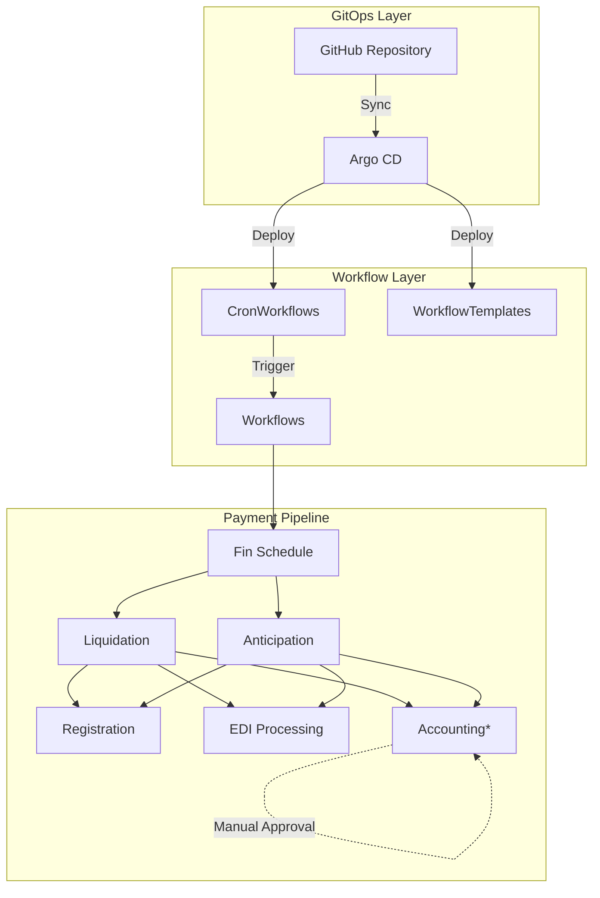

# Argo Workflows & Argo CD: Payment Processing PoC

[](LICENSE)
[](https://kubernetes.io/)
[](https://argoproj.github.io/argo-workflows/)
[](https://argo-cd.readthedocs.io/)

A comprehensive Proof of Concept (PoC) demonstrating the capabilities of **Argo Workflows** as a job scheduler for heavy workload processing in the card payments industry, along with seamless integration with **Argo CD** for GitOps-based deployment management.

## 🎯 Project Overview

This project validates the feasibility of using Argo Workflows as an enterprise-grade job scheduler for financial payment processing pipelines. It showcases:

- **Complex workflow orchestration** for payment processing stages
- **Manual approval gates** for critical financial operations
- **Automated scheduling** with cron-based triggers
- **GitOps deployment** using Argo CD
- **Production-ready patterns** for financial services

## 🏗️ Architecture



*\* Requires manual approval*

## 📁 Project Structure

```
├── .k8s/                           # Kubernetes RBAC configurations
│   └── argo-workflow-rbac-default.yaml
├── cd/                             # Argo CD Applications
│   ├── workflows-crons.yaml       # CronWorkflow deployment
│   └── workflows-templates.yaml   # WorkflowTemplate deployment
├── workflows/
│   ├── payments-wf.yaml           # Main payment workflow
│   ├── cron/                      # Scheduled workflows
│   │   ├── basic-cron.yaml
│   │   └── daily-payments-cron.yaml
│   └── templates/                 # Reusable workflow templates
│       ├── failed-job-template.yaml
│       ├── manual-approval-template.yaml
│       ├── payments-wf-template.yaml
│       └── successful-job-template.yaml
├── Makefile                       # Development automation
└── README.md
```

## 🚀 Quick Start

### Prerequisites

- **Docker** (for Minikube)
- **Minikube** (local Kubernetes cluster)
- **kubectl** (Kubernetes CLI)
- **Git** (for GitOps workflow)

### 1. Environment Setup

```bash
# Create and start Minikube cluster
make create-cluster

# Start the cluster and set context
make start-cluster
```

### 2. Install Argo Components

```bash
# Install Argo Workflows
make argo-workflows

# Install Argo CD
make argo-cd
```

### 3. Configure RBAC

```bash
# Apply workflow RBAC permissions
kubectl apply -f .k8s/argo-workflow-rbac-default.yaml
```

### 4. Deploy via Argo CD

```bash
# Deploy workflow templates
kubectl apply -f cd/workflows-templates.yaml

# Deploy cron workflows  
kubectl apply -f cd/workflows-crons.yaml
```

### 5. Access UIs

```bash
# Argo Workflows UI
kubectl port-forward -n argo svc/argo-server 2746:2746
# Open: https://localhost:2746

# Argo CD UI
kubectl port-forward -n argocd svc/argocd-server 8080:443
# Open: https://localhost:8080
# Username: admin
# Password: kubectl get secret argocd-initial-admin-secret -n argocd -o jsonpath="{.data.password}" | base64 -d
```

## 💳 Payment Workflow Details

### Workflow Stages

The payment processing pipeline consists of the following stages:

1. **Financial Schedule** - Initial payment scheduling and validation
2. **Liquidation** - Payment settlement processing  
3. **Anticipation** - Early payment processing
4. **Registration** - Transaction registration and recording
5. **EDI** - Electronic Data Interchange processing
6. **Accounting** - Final accounting reconciliation (requires manual approval)

### Dependencies

```yaml
Fin Schedule (Start)
├── Liquidation (depends on: fin-schedule)
└── Anticipation (depends on: fin-schedule)
    ├── Registration (depends on: liquidation, anticipation)
    ├── EDI (depends on: liquidation, anticipation)  
    └── Accounting (depends on: liquidation, anticipation) [Manual Approval Required]
```

### Manual Approval Process

The accounting stage implements a manual approval gate:
- Workflow pauses for up to 24 hours
- Requires manual intervention to proceed
- Ensures compliance with financial regulations
- Provides audit trail for critical operations

## 📅 Scheduling

The project includes automated scheduling capabilities:

- **Daily execution**: Every 2 minutes (for demo purposes)
- **Timezone aware**: America/Sao_Paulo
- **Concurrency control**: Forbids overlapping executions
- **History management**: Keeps 2 successful and 2 failed job histories

```yaml
schedule: "*/2 * * * *"  # Every 2 minutes
timezone: "America/Sao_Paulo"
concurrencyPolicy: "Forbid"
```

## 🔧 Configuration

### Environment Variables

The fake job container accepts the following configuration:

- `SECONDS_TO_SLEEP`: Simulates job execution time (default: 5 seconds)

### Workflow Templates

- **successful-job-template**: Simulates successful payment processing jobs
- **manual-approval-template**: Implements approval gates with configurable timeouts
- **failed-job-template**: Simulates failure scenarios for testing
- **payments-wf-template**: Main payment workflow orchestration

## 🎛️ Makefile Commands

```bash
make create-cluster     # Create new Minikube cluster
make start-cluster      # Start existing cluster
make delete-cluster     # Delete Minikube cluster  
make argo-workflows     # Install Argo Workflows
make argo-cd           # Install Argo CD
```

## 🔍 Monitoring & Observability

### Workflow Status

Monitor workflow execution through:

- **Argo Workflows UI**: Real-time workflow visualization
- **kubectl**: Command-line workflow inspection
- **Argo CD UI**: GitOps deployment status

```bash
# List workflows
kubectl get workflows

# Describe specific workflow
kubectl describe workflow <workflow-name>

# View workflow logs
kubectl logs <pod-name>
```

### Key Metrics

Track important operational metrics:

- Workflow execution time
- Success/failure rates  
- Manual approval response times
- Resource utilization
- Schedule adherence

## 🔒 Security Considerations

### RBAC Configuration

The project implements least-privilege RBAC:

- Dedicated service account for workflow execution
- Scoped permissions for workflow operations
- Namespace isolation for different environments

### Financial Compliance

- Manual approval gates for critical operations
- Comprehensive audit logging
- Immutable workflow definitions
- GitOps-based change management

## 🧪 Testing & Validation

### Workflow Testing

```bash
# Submit test workflow
kubectl create -f workflows/payments-wf.yaml

# Monitor execution
kubectl get workflows -w

# Check logs
kubectl logs -l workflows.argoproj.io/workflow=<workflow-name>
```

### Failure Scenarios

The project includes templates for testing failure conditions:
- Job timeouts
- Resource constraints  
- Manual approval timeouts
- Dependency failures

## 🚀 Production Considerations

### Scalability

- **Horizontal scaling**: Multiple workflow executors
- **Resource management**: CPU/memory limits and requests
- **Persistence**: Workflow state stored in etcd
- **Load balancing**: Multiple Argo CD replicas

### High Availability

- **Multi-zone deployment**: Kubernetes node distribution
- **Database redundancy**: PostgreSQL clustering for Argo CD
- **Backup strategy**: Workflow definitions and execution history
- **Disaster recovery**: Cross-region replication

### Performance Optimization

- **Resource tuning**: Optimize container resource allocation  
- **Parallelization**: Concurrent workflow execution
- **Caching**: Workflow template reuse
- **Monitoring**: Performance metrics and alerting

## 📚 Additional Resources

- [Argo Workflows Documentation](https://argoproj.github.io/argo-workflows/)
- [Argo CD Documentation](https://argo-cd.readthedocs.io/)
- [Kubernetes Best Practices](https://kubernetes.io/docs/concepts/configuration/overview/)
- [GitOps Principles](https://www.gitops.tech/)

## 🤝 Contributing

1. Fork the repository
2. Create a feature branch (`git checkout -b feature/amazing-feature`)
3. Commit changes (`git commit -m 'Add amazing feature'`)
4. Push to branch (`git push origin feature/amazing-feature`)
5. Open a Pull Request

## 📄 License

This project is licensed under the MIT License - see the [LICENSE](LICENSE) file for details.

## 🏢 Enterprise Support

For enterprise deployments and production support:
- Performance tuning consultations
- Custom workflow development
- Integration with existing payment systems
- Compliance and security auditing

---

**Built with ❤️ for the payments industry**